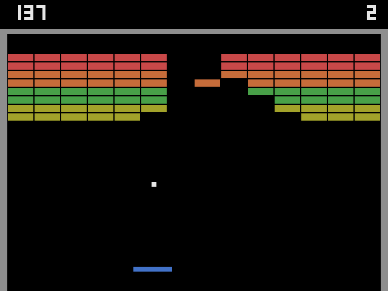

# paredao-poliglota

O Paredão é um jogo de derrubar tijolos inspirado no **Breakout** (Atari, 1976),
implementado em 10 linguagens sobre a **SDL2**. É o terceiro jogo da série,
depois do [pong-poliglota](https://github.com/marciocr/pong-poliglota) e do
tanques-poliglota. Segue as mesmas regras: mesmas constantes, mesmas funções
(`update`, `find_brick`, `break_brick`, `launch`...) e mesmo loop com física em
passo fixo, sem nenhum arquivo externo de imagem, fonte ou som.



| Linguagem     | Pasta                | Binding SDL2                              | Build                | Executar                        |
|---------------|----------------------|-------------------------------------------|----------------------|---------------------------------|
| C++17         | [`cpp/`](cpp/)       | headers C oficiais                        | CMake                | `./build/paredao`               |
| Rust          | [`rust/`](rust/)     | crate `sdl2` 0.38                         | Cargo                | `cargo run --release`           |
| Go            | [`go/`](go/)         | `veandco/go-sdl2` (cgo)                   | `go.mod`             | `./paredao`                     |
| D             | [`dlang/`](dlang/)   | `bindbc-sdl` 1.5 (carga dinâmica)         | dub (`dub.json`)     | `./paredao`                     |
| Object Pascal | [`pascal/`](pascal/) | unit própria `sdl2mini.pas` (`external`)  | FPC via `build.sh`   | `./build/paredao`               |
| Perl          | [`perl/`](perl/)     | FFI::Platypus direto na `libSDL2`         | `cpanfile`           | `./paredao.pl`                  |
| Python        | [`python/`](python/) | PySDL2 (ctypes, API de baixo nível)       | `requirements.txt`   | `./paredao.py`                  |
| Lua (LuaJIT)  | [`lua/`](lua/)       | FFI do LuaJIT direto na `libSDL2`         | nenhum (`luajit`)    | `./paredao.lua`                 |
| Java 25       | [`java/`](java/)     | API FFM (`java.lang.foreign`)             | Maven (`pom.xml`)    | `java -jar target/paredao.jar`  |
| C# (.NET 10)  | [`csharp/`](csharp/) | P/Invoke com `[LibraryImport]`            | `dotnet` (`.csproj`) | `dotnet run -c Release`         |

Cada pasta tem um `README.md` com as dependências e os comandos exatos de
build e execução.

## Como jogar

- **←/→** ou **A/D** movem a raquete. **Espaço** saca a bola e, no fim de
  jogo, começa uma partida nova.
- São **3 bolas**. O placar fica à esquerda, e as bolas restantes à direita.
  No fim de jogo, o placar pisca.
- **Esc** sai.

## Especificação comum

- **Tijolos:** janela 640×480. São 8 fileiras de 14 tijolos, cada tijolo com
  44×14 px. As cores e os pontos seguem o arcade:

  | Fileiras (de cima) | Cor      | Pontos | Som do tijolo |
  |--------------------|----------|-------:|--------------:|
  | 1 e 2              | vermelho | 7      | 880 Hz        |
  | 3 e 4              | laranja  | 5      | 660 Hz        |
  | 5 e 6              | verde    | 3      | 520 Hz        |
  | 7 e 8              | amarelo  | 1      | 440 Hz        |

- **Velocidade:** a bola sai a 240 px/s e ganha +60 px/s em cada marco do
  Breakout original: no 4º tijolo, no 12º tijolo, na primeira batida numa
  fileira laranja e na primeira batida numa vermelha. O máximo é 480 px/s.
- **Raquete:** quando a bola bate na parede de cima, a raquete **encolhe pela
  metade**, como no original. Cada bola nova volta com a raquete inteira e a
  velocidade base.
- **Rebote na raquete:** a raquete tem **8 zonas**, cada uma com um ângulo
  fixo (15°, 30°, 45° ou 60° para cada lado), em vez de um ângulo contínuo.
  É como os segmentos do Breakout original, e também o que garante a
  equivalência entre as linguagens (explicado abaixo).
- **Saque:** a 60°, para o lado da tela com mais espaço em frente à raquete.
  O jogo não tem nenhuma aleatoriedade.
- **Parede limpa:** quando todos os tijolos são destruídos, uma parede nova
  aparece.
- Física em passo fixo de 1/120 s. Colisão por eixo: o movimento em x e o
  movimento em y são testados separadamente, o que diz qual componente da
  velocidade refletir.
- Áudio em onda quadrada via `SDL_QueueAudio`. A raquete toca 460 Hz, a
  parede 230 Hz, e a bola perdida 110 Hz por 500 ms.

## Equivalência entre as versões

As 10 implementações chegam **exatamente ao mesmo estado** para a mesma
sequência de teclas. A verificação usou roteiros gravados de um "robô"
jogando partidas longas, roteiros aleatórios e um roteiro de game over. No
total foram 1.450 tijolos quebrados, 3 paredes novas, 29 vezes a raquete
encolhendo, 70 bolas perdidas e 23 game overs com reinício. Em todos eles,
placar, bolas, posição e velocidade da bola ficaram idênticos até a 4ª casa
decimal.

A primeira versão calculava o ângulo de rebote com `sin`/`cos` contínuos, e
aí Go, D, Pascal e Java divergiam das outras em partidas longas. Cada uma
dessas linguagens tem a própria implementação de `sin`/`cos`, que pode
diferir da `libm` do sistema no último bit do `double`. Depois de dezenas de
rebotes, essa diferença de 1 ulp cresce até mudar uma colisão. A solução foi
a tabela de 8 zonas com senos e cossenos escritos como **literais
decimais**, que todas as linguagens convertem para o mesmo `double`.

## Dependências de sistema (Fedora)

Tudo está nos repositórios padrão do Fedora; não é preciso RPM Fusion nem
COPR.

```bash
sudo dnf install gcc-c++ cmake sdl2-compat-devel rust cargo golang ldc dub fpc perl perl-FFI-Platypus perl-FFI-CheckLib python3 python3-pysdl2 luajit java-25-openjdk-devel maven dotnet-sdk-10.0
```

## Créditos

Inspirado no Breakout (Atari, 1976), projetado por Nolan Bushnell e Steve
Bristow, com o protótipo construído por Steve Wozniak. Breakout é marca
registrada da Atari; este é um projeto independente, sem código nem arte do
original.
